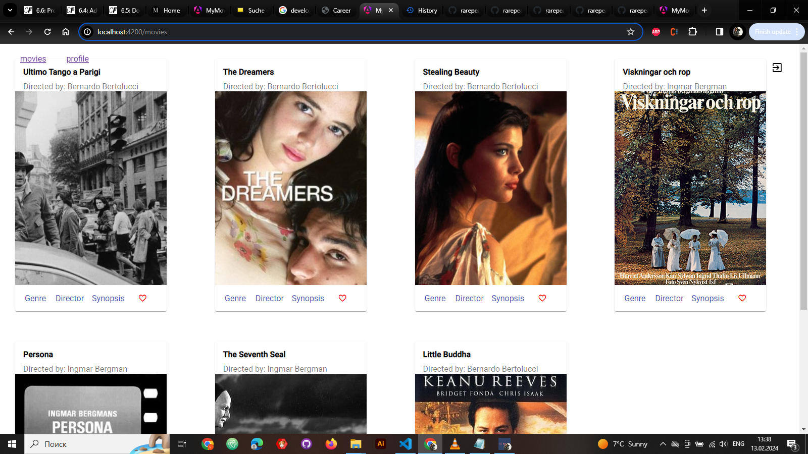

# myMovies-ng-cli Portfolio Project 

Welcome to myMovies-ng-cli, a portfolio project showcasing my skills in building Angular applications. This project serves as a client for the Movie API, displaying movie data with a user-friendly interface using Angular Material.

## Overview
- 
- Angular Version: 17.1.2
- Angular CLI Version: 17.1.2

## Live Demo
- [demo](https://rarepearlgirl.github.io/myMovies-ng-cli/movies)

## Project Highlights
- **One-Page Layout**: The application follows a one-page layout, providing a seamless and intuitive user experience.
- **Google Material Design**: Leveraging Angular Material for a visually appealing and responsive design.

## Technologies Used
- Angular: A powerful web application framework.
- Angular Material: A UI component library for Angular applications.
- RxJS: A library for reactive programming using Observables.

## Getting Started
1. Clone the repository: `git clone https://github.com/rarepearlgirl/myMovies-ng-cli.git`
2. Install dependencies: `npm install`
3. Run the development server: `ng serve`
4. Navigate to [http://localhost:4200/](http://localhost:4200/) to view the application.

## Deployment
Deploy the application using the following command:

 - ng deploy --base-href=/myMovies-ng-cli/

## Author
 - [rarepearlgirl](https://github.com/rarepearlgirl)

## License

This project is open-source and available under the [\[MIT License\] (MIT License).](https://opensource.org/license/mit/)

